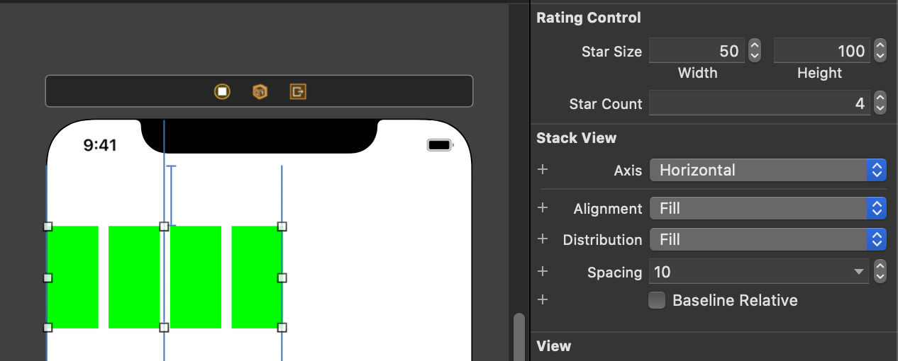
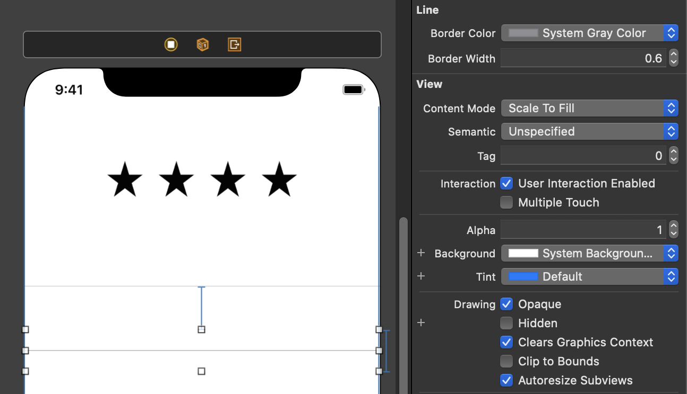

# IBDesignable과 IBInspectable

- @IBDesignable과 @IBInspectable을 이용하면, 커스텀 뷰를 Interface Builder에 보여주거나 Interface Builder에서 제어하도록 만들수 있습니다.
- 커스텀 뷰를 @IBDesignable로 선언하면, 인터페이스 빌더가 커스텀 뷰의 인스턴스를 생성하여 스토리보드에 직접 그려줍니다.
- @IBInspectable을 이용해서 Attributes inspector에서 세팅할 수 있는 프로퍼티를 만들 수 있습니다.
- Interface Builder는 기본 타입들(booleans, numbers, strings)과 기본 타입들의 옵셔널들, 그리고 CGRect, CGSize, CGPoint, UIColor를 지원합니다.
- 소스 코드에 브레이크 포인트를 추가하고, Editor > Debug Selected Views를 선택하면, 브레이크 포인트에 멈춰서 커스텀 뷰를 디버깅할 수 있습니다.(?)

### IBDesignable

```swift
@IBDesignable
class RatingControl: UIStackView {
    
    override init(frame: CGRect) {
        super.init(frame: frame)
        setupButtons()
    }
    
    required init(coder: NSCoder) {
        super.init(coder: coder)
        setupButtons()
    }
    
    private func setupButtons() {
        for _ in 0..<5 {
            let button = UIButton()
            
            button.translatesAutoresizingMaskIntoConstraints = false
            button.heightAnchor.constraint(equalToConstant: 40).isActive = true
            button.widthAnchor.constraint(equalToConstant: 40).isActive = true
            
            addArrangedSubview(button)
        }
    }
}
```
위와 같이 Interface Builder를 통해 호출되는 init(coder:)에서 setupButton을 호출하도록 만들어서 오토 레이아웃을 설정한 결과를 인터페이스 빌더에서 바로 확인할 수 있습니다.

### IBInspectable

```swift
@IBDesignable
class RatingControl: UIStackView {
    
    @IBInspectable var starSize: CGSize = CGSize(width: 44.0, height: 44.0) {
        didSet { setupButtons() }
    }
     
    @IBInspectable var starCount: Int = 5 {
        didSet { setupButtons() }
    }
    
    override init(frame: CGRect) {
        super.init(frame: frame)
        setupButtons()
    }
    
    required init(coder: NSCoder) {
        super.init(coder: coder)
        setupButtons()
    }
    
    private var ratingButtons = [UIButton]()
    
    private func setupButtons() {
        
        for button in ratingButtons {
            removeArrangedSubview(button)
            button.removeFromSuperview()
        }
        
        for _ in 0..<starCount {
            let button = UIButton()
            button.backgroundColor = .green
            
            button.translatesAutoresizingMaskIntoConstraints = false
            button.heightAnchor.constraint(equalToConstant: starSize.height).isActive = true
            button.widthAnchor.constraint(equalToConstant: starSize.width).isActive = true
            
            addArrangedSubview(button)
            
            ratingButtons.append(button)
        }
    }
}
```

커스텀 뷰를 @IBInspectable로 지정된 프로퍼티에 따라서 업데이트하려면, 각각의 프로퍼티에 프로퍼티 감시자를 추가해서 뷰를 다시 세팅해줘야 합니다.



### 이미지 추가하기

```swift
let bundle = Bundle(for: type(of: self))
let star = UIImage(named: "star", in: bundle, compatibleWith: self.traitCollection)
```

위 코드는 Assets catalog로부터 이미지를 로드합니다. 에셋 카탈로그는 앱의 main bundle에 위치하기 때문에, 앱에서는 `UIImage(named:)` 메서드를 이용해 이미지를 로드할 수 있지만, @IBDesignable로 선언된 커스텀 뷰는 인터페이스 빌더에서도 동작해야 합니다. 이미지들이 인터페이스 빌더에서 로드될 수 있도록 하기 위해서, 카탈로그의 번들을 명시해야 합니다.

### 응용: draw() 오버라이드하기

```swift
@IBDesignable
class Line: UIView {
    
    @IBInspectable var borderColor: UIColor? {
        didSet { setNeedsDisplay() }
    }

    @IBInspectable var borderWidth: CGFloat = 0 {
        didSet { setNeedsDisplay() }
    }
    
    override func draw(_ rect: CGRect) {
        let aPath = UIBezierPath()
        let centerY = frame.height / 2
        aPath.move(to: CGPoint(x: 0, y: centerY))
        aPath.addLine(to: CGPoint(x: frame.width, y: centerY))
        aPath.close()
        borderColor!.set()
        aPath.lineWidth = borderWidth
        aPath.stroke()
    }
}
```

draw()를 오버라이드한 후 프로퍼티가 바뀔 때마다 setNeedsDisplay()를 이용해 뷰를 다시 그려주도록 설정하면, 뷰를 그린 결과를 인터페이스 빌더에서 볼 수 있습니다.



### References

* [Xcode Help — Debug custom views in Interface Builder][xcode-help]
* [Start Developing iOS Apps (Swift)][ios-app-guide]


[xcode-help]: https://help.apple.com/xcode/mac/current/#/dev5df060a3b
[ios-app-guide]: https://developer.apple.com/library/archive/referencelibrary/GettingStarted/DevelopiOSAppsSwift/ImplementingACustomControl.html#//apple_ref/doc/uid/TP40015214-CH19-SW1
