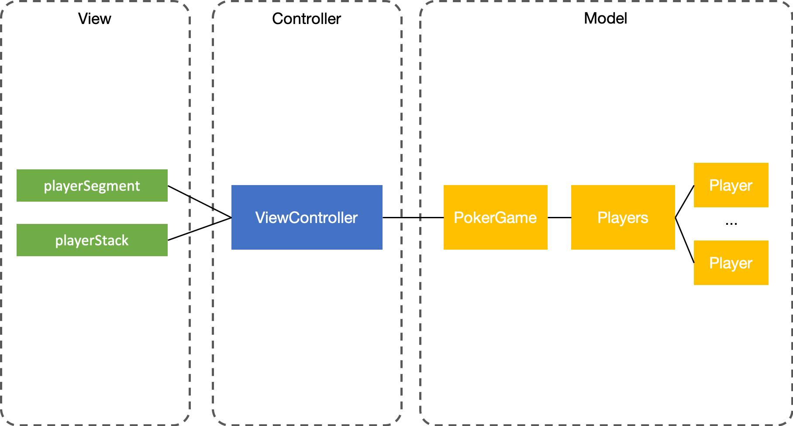
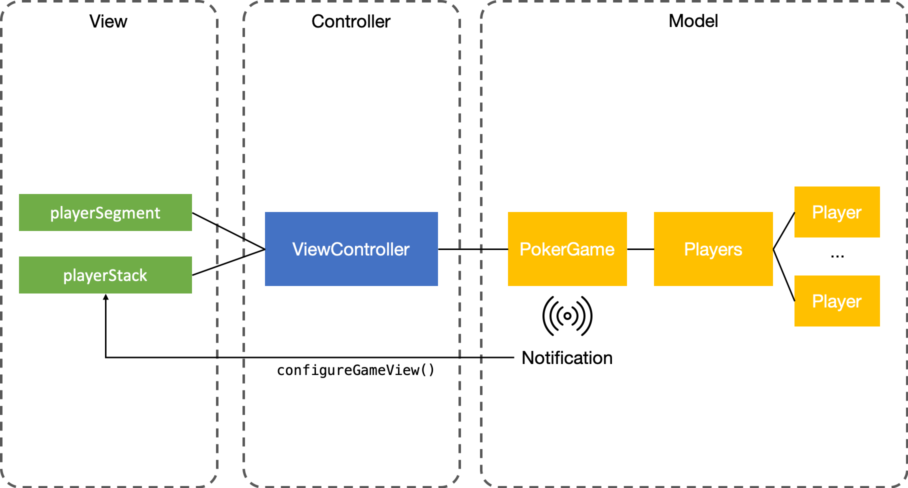
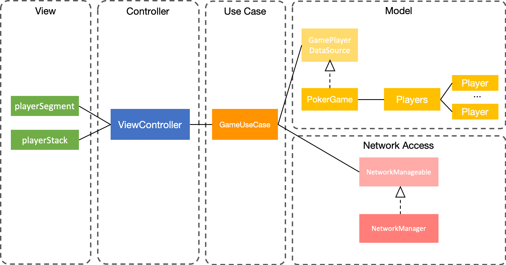

# MVC

3가지의 점점 개선되는 MVC 구조로 작성된 [포커게임 앱][pokergameapp] 코드를 분석하고, MVC 구조에 대해 정리하였습니다. 이 샘플 코드에는 참여자 수가 바뀔 때마다 뷰가 바뀌는 동작이 구현되어 있습니다.

## Step1. 흔히 작성하는 MVC 구조



- playerSegment가 변경되면, 선택된 세그먼트 컨트롤의 개수에 따른 플레이어 수를 가진 PokerGame 인스턴스를 생성하고, 플레이어 수에 맞게 뷰를 업데이트합니다.
- 이벤트에 따른 모델 변경 흐름과 모델 변경에 따른 뷰 업데이트 흐름이 구분되어 있지 않고, 함께 이루어집니다.

```swift
// 세그먼트 컨트롤이 바뀔 때마다 호출되는 메서드
private func resetGame() {
    configureGame() // 모델 변경 후
    configureGameView() // 바로 뷰 업데이트
}
```

- 모델이 여러 곳에서 바뀌는 경우, 그 때마다 항상 뷰를 같이 업데이트해줘야 하는 단점이 있습니다.

## Step2. Step1을 개선한 MVC + Observer 구조



- 사용자 이벤트에 의해 playerSegment가 변경되면, 모델만 변경합니다.

```swift
@objc func playerChanged(_ sender: UISegmentedControl) {
    configureGame()
}
```

- 모델 변경에 따른 뷰 업데이트 바인딩

```swift
private func configureSubscriber() {
    gamePublisher = NotificationCenter.default
            .publisher(for: PokerGame.Notification.DidChangePlayers)
            .sink { notification in
                DispatchQueue.main.async {
                    self.configureGameView()
                }
            }
}
```

- publisher(for:object:) — Publisher를 반환해줍니다.
- sink — Subscriber를 만들어줍니다. Publisher에 연결되는 것 같고, 클로저를 실행해 주는 것 같습니다..
- 모델이 변경되는 노티피케이션에 따라서 뷰를 업데이트합니다.
- 이벤트에 따른 모델 변경 흐름과, 모델 변경에 따른 뷰 업데이트 흐름이 구분되어 있습니다. 모델을 변경하면 뷰가 알아서 업데이트되기 때문에 중복되는 코드를 줄일 수 있고, 유지보수에 용이합니다.

## Step3. Network + Observer + Protocol Oriented 구조



- Step2에서 네트워크에서 데이터를 가져와 모델을 업데이트하는 기능이 추가되었습니다.
- 모델이 변경되는 노티피케이션에 따라 뷰를 업데이트하는 부분은 이전 단계와 같습니다.
- GameUseCase는 구체 타입이 아니라 NetworkManageable과 GameDataSource 프로토콜에 의존합니다. makeGame은 원격에서 데이터를 가져와 디코딩하는 일을 합니다.

```swift
struct GameUseCase {
    static func makeGame(with manager: NetworkManable, completed: @escaping (GamePlayerDataSource?) -> ()) {
        try? manager.getResource(from: NetworkManager.EndPoints.Players) { (data, error) in
            guard let data = data else { return }
            let names = try? JSONDecoder().decode([Player].self, from: data).map{ $0.name }
            let game = PokerGame(with: names ?? [])
            completed(game)
        }
    }
}
```

- configureUseCase 메서드를 호출하면, 유스케이스를 실행시킵니다. 네트워크에서 데이터를 가져와 모델에 저장하는 일을 합니다.

```swift
private func configureUsecase() {
    GameUseCase.makeGame(with: NetworkManager()) { (gameDataSource) in
        self.game = gameDataSource
    }
}
```

### 유스케이스에 대해

> 유스케이스란, 목표를 이루기 위해 UML에서 액터와 시스템의 상호작용을 정의한 일련의 행위이다. — 위키피디아

예를 들어, ATM 시스템의 유스케이스는 계좌 조회, 인출, 이체 등이 있습니다.

> 클린 아키텍쳐의 유스케이스는, 엔티티를 이용한 데이터의 흐름을 조절하며, 이 엔티티를 유스케이스의 목적을 이루기 위한 비즈니스 룰에 사용한다.

### 이해한 내용

유스케이스는 모델(또는 엔티티) 객체들을 어떻게 사용할 것인지를 메서드로 정의해 놓은 것이고, Step3의 포커게임 앱에서는, 포커 게임 플레이라는 유스케이스를 달성하기 위해 makeGame 메서드를 정의해 놓았습니다. 모델을 컨트롤러에서 직접 제어하는 것이 아니라, 유스케이스를 통해서 제어한다는 특징이 있는 것 같습니다.


[pokergameapp]: https://github.com/godrm/swift-pokergameapp/
